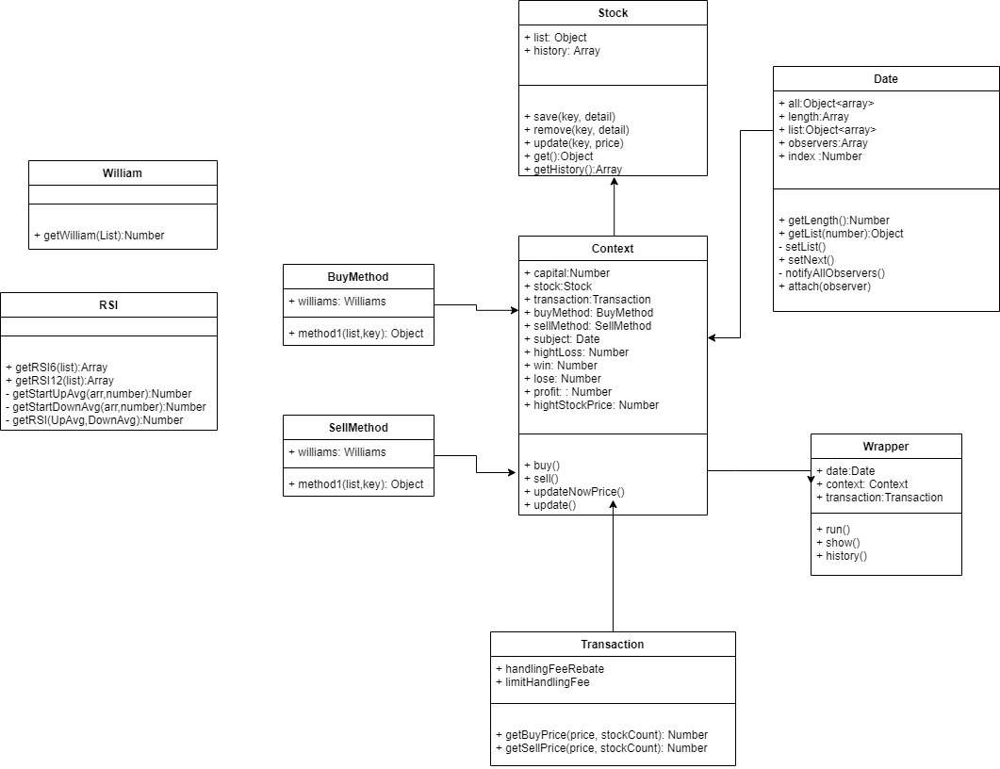

# 回測系統

  

回測系統需求：
1. 系統依照前一日計算條件再以今日開盤價買進，系統在符合賣出條件時以當日收盤價賣出。
2. 可以提供指定的資料格式測試。
3. 可以設定本金、手續費、最低手續費、證交稅 及提供資料區間。
4. 當本金不夠時停止買進。
5. 當收盤股價(價格-手續費-0.3%證交稅)低於買進股價(價格+手續費)時不賣出。
6. 當股價虧損超過10%則賣出。

> Please use node@16.0.0  
> nodejs execute python web crawler  
> Used OOP develope  
> Design Pattern: 
> - wrapper pattern, 
> - observer pattern, 
> - factory method pattern, 
> - state pattern  


example:
```json
{
    "1101":
        [
            {"t":20201028,"o":40.55,"h":40.7,"l":40.55,"c":40.55,"v":8139,"name":null},
            {"t":20201029,"o":40.35,"h":40.55,"l":40.2,"c":40.35,"v":9367,"name":null}
        ],
}
```
## Wapper 適配器
Wapper Props
Name               | Type    | Default                | Description
-------------------|:-------:| ----------------------:|------------------------
capital            | Number  |                 300000 | 本金
date               | Require |                        | (迴歸)資料日期系統
hightLoss          | Number  |                    0.1 | 虧損超過%數
handlingFeeRebate  | Number  |                   0.65 | 手續費折扣
limitHandlingFee   | Number  |                     20 | 最低手續費
hightStockPrice    | Number  |                    150 | 限制購買低於此股價的股票
----------------

<br/>

## 資料日期
Date Props
Name                | Type   | Default                | Description
--------------------|:------:| ----------------------:|------------------------
defaultDataCount    | Number |                     30 | 預設起始資料中包含 n 筆資料 (建議: 以最高skill 日期為主，假如邏輯含有MA60，則設定60天)
data                | JSON   | 20201028_20210628.json | 提供資料檔

<br/>

## 主系統
Context Props
Name               | Type   | Default | Description
-------------------|:------:| -------:|------------------------
capital            | Number |  300000 | 本金
subject            | Object |    Date | (迴歸)資料日期系統
hightLoss          | Number |     0.1 | 虧損超過%數
handlingFeeRebate  | Number |    0.65 | 手續費折扣
limitHandlingFee   | Number |      20 | 最低手續費
hightStockPrice    | Number |     150 | 限制購買低於此股價的股票

<br/>

## 買進/賣出邏輯
You can add method2 in BuyMethod, and change context.buy() of this.buyMethod.method1();  

You can add method2 in SellMethod, and change context.sell() of this.sellMethod.method1();

